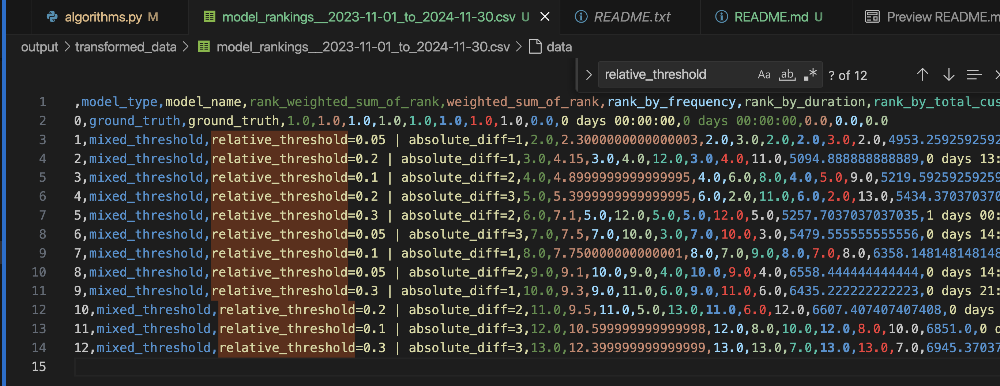

# Pipeline Running
Please refer to `EXPERIMENT_REPRODUCTION.md` for guidance. It's not much different from the `GROWER M&V Pipeline Meta Doc.pdf`. I modified some parameters, but nothing too significant. This repo serves as our own project repo.
# Old One-Click method by Howshing
1. `pip install rich-click`
## How to run
1. `python mvp_handler.py -c {config file} -a {algo name}`. 
2. ex: `python mvp_handler.py -c mvp_config.yaml -a mixed_threshold`
## Instructions
1. please find the todo sections
2. should see something like this in the output file:
    
